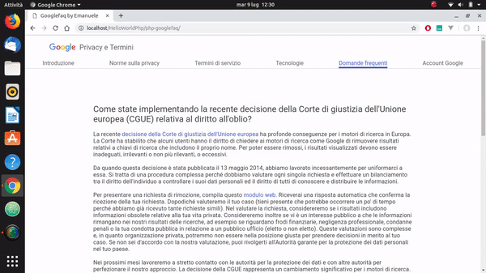

# PHP-Google FAQ
Replica della pagina delle faq di [Google](https://policies.google.com/faq).
## Descrizione
Il contenuto testuale della pagina,ovvero le domande e le risposte,sono allocate nel 'server',nel file var.php.
 
Nel file print.php,invece,è presente la funzione PHP che permette la stampa delle domande e delle risposte nell'index.php.
## Tecnologie utilizzate
HTML,CSS,PHP.
## Screenshots

